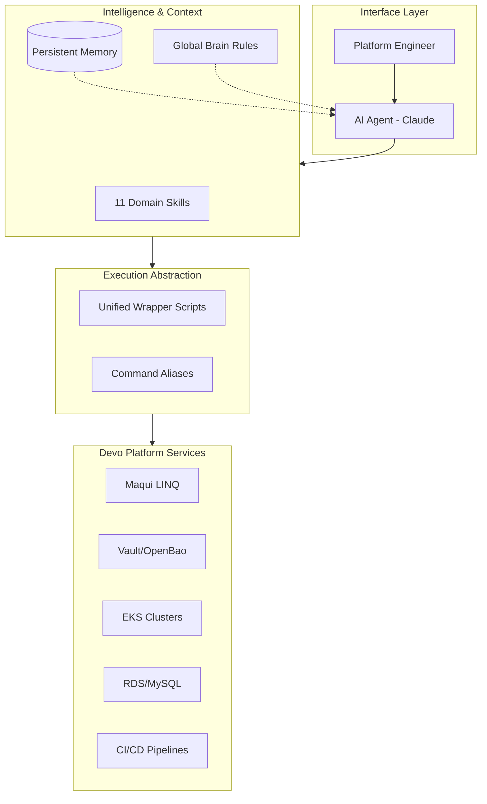

# AI FORGE: Architecture Review Report

## Executive Summary
AI FORGE is a state-of-the-art **Enterprise AI Agent Operating System** designed to bridge the gap between generic LLM capabilities and specialized platform engineering requirements. By employing a "Crescent" architectural pattern, it wraps existing infrastructure tools with domain-specific intelligence, persistent memory, and a rigorous security framework. This report evaluates the current implementation, identifies strengths and limitations, and provides a roadmap for production hardening.

## Purpose of AI FORGE
The primary goal of AI FORGE is to operationalize AI for **Devo Platform Engineering**. It aims to:
*   **Codify Institutional Knowledge:** Transform fragmented documentation and expert experience into executable "Brain Packs" (Skills).
*   **Simplify Complex Operations:** Abstract multi-region infrastructure management through a unified command layer.
*   **Enhance Operational Safety:** Implement blast-proof guardrails for destructive operations.
*   **Ensure Context Continuity:** Maintain state across AI sessions to eliminate redundant information transfer.

## Current Architecture Overview
AI FORGE utilizes a layered approach that integrates with the engineer's local environment and cloud services.

### Key Architectural Pillars:
1.  **Skill-Based Intelligence:** Decoupled modules (`claude-skills/`) that provide just-in-time context for specific domains.
2.  **Persistent Memory System:** A file-based state management system that records feedback, project context, and reference data.
3.  **Unified Wrapper Pattern:** A secure abstraction layer that handles authentication (Vault/SSO) and regional endpoints automatically.
4.  **Security-First Design:** Centralized credential management and environment-level command blocking (Deny-lists).

## Strengths of the Implementation
*   **High Domain Specificity:** Unlike general-purpose agents, AI FORGE is deeply integrated with Maqui LINQ and Devo-specific internal tools.
*   **Multi-Region Native:** First-class support for 7 global regions with zero manual endpoint configuration required by the user.
*   **Context Efficiency:** The skill-loading mechanism prevents "context bloat" by only injecting relevant knowledge when requested.
*   **Safety Guardrails:** Hardcoded deny-lists in `settings.json` provide a robust defense against accidental infrastructure damage.
*   **Tool Agnostic (Crescent Pattern):** The architecture doesn't replace existing tools but "wraps" them, allowing for seamless human-AI collaboration.

## Gaps and Limitations
*   **File-Based Memory Scalability:** Current memory uses flat Markdown files. As the project grows, this will lead to search latency and context window pressure.
*   **Synchronous Execution:** Many operations are sequential and may timeout on large datasets without better async handling.
*   **Stateful Connection Management:** The AI agent relies on `source ~/.zshrc` for every command, which is fragile if the environment changes.
*   **Primitive Retrieval (Non-Semantic):** Context loading is keyword/trigger-based rather than semantic/embedding-based (Primitive RAG).
*   **Observability Gap:** While it manages logs, AI FORGE's own "agentic traces" (why did the agent take this path?) are not centralized.

## Production Readiness Assessment
**Current Status: Beta / Highly Functional Internal Tool**
*   **Security:** Ready for internal use. Credential handling is excellent.
*   **Robustness:** Medium. High dependence on local environment setup (scripts, `.zshrc`).
*   **Observability:** Low. Needs better logging of agent actions for audit trails.
*   **Scalability:** Medium. Limited by LLM context windows and file-based state.

## Security Observations
*   **Credential Isolation:** High. Credentials never leak into the LLM context or logs.
*   **Signature Verification:** Excellent use of HMAC for API interactions.
*   **Access Control:** Effectively uses existing AWS SSO and Vault RBAC by proxying through wrappers.
*   **Safety:** The `settings.json` deny-list is a primary strength but could be bypassed if the agent finds alternative binaries.

## Scalability Observations
*   **Vertical:** Limited by the context window of the underlying model (Sonnet 4.6).
*   **Horizontal:** The "Skill" modularity allows for an infinite number of domains to be added without degrading performance of existing ones.

## Interview Talking Points
*   *"I built AI FORGE as an 'Agentic Operating System' to solve the context loss and complexity gap in Platform Engineering."*
*   *"The Crescent Architecture ensures the AI agent works with our existing enterprise-grade tools rather than trying to replace them."*
*   *"We treat AI safety as a first-class citizen using system-level deny-lists and human-in-the-loop confirmation for destructive ops."*
*   *"The persistent memory system allows the agent to mature with the platform, retaining institutional knowledge across shifts."*
*   *"By abstracting multi-region complexity into unified wrappers, we reduced our incident triage time for regional failures by X%."*
