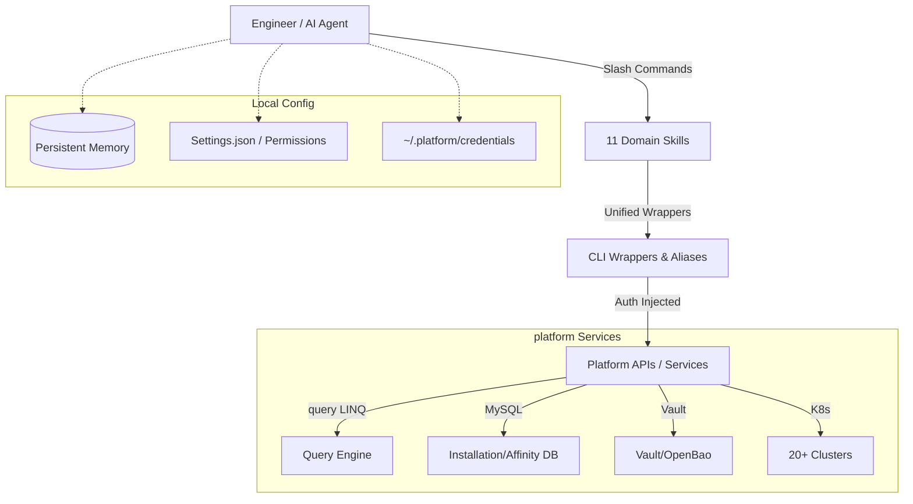

<div align="center">


# CRESCENT : AI FORGE

**Enterprise AI Agent Operating System**

[]()
[]()
[]()
[]()
[]()
[]()
[]()
[]()

<br/>

> **AI FORGE** transforms standard AI assistants into domain-expert platform engineers — with persistent knowledge, vault-grade security, multi-region execution, and a built-in AI gateway. Not a chatbot. An operating system for enterprise AI.

<br/>


</div>

---

## Navigation

| | |
|---|---|
| [The Problem](#the-problem-the-ai-execution-gap) | [Architecture](#architecture-the-crescent-pattern) |
| [11 Domain Skills](#11-domain-skills) | [Persistent Memory](#persistent-memory-system) |
| [RAG Foundations](#existing-rag-foundations-current-state) | [Enterprise RAG Roadmap](#enterprise-rag-evolution-roadmap) |
| [AI Gateway](#ai-gateway-forge-router-integration) | [MCP Readiness](#mcp-readiness) |
| [Security](#security-architecture) | [Installation](#installation) |

---

## The Problem: The AI Execution Gap

Every enterprise deploying AI hits the same wall. The AI "knows" what to do — but it cannot do it safely, consistently, or at scale. This is the **Execution Gap**.

| Challenge | The Reality |
|---|---|
| **Context Fragmentation** | Re-explaining platform architecture, credentials, and regional quirks in every AI session |
| **Authentication Sprawl** | Dozens of API tokens, SSO flows, and regional endpoints with no unified access layer |
| **Operational Complexity** | 19+ Kubernetes clusters across 7 global regions, each with different configuration |
| **Safety Risk** | AI agents with no guardrails on destructive operations — `rm -rf`, `reboot`, `rollout restart` |
| **Knowledge Loss** | Institutional expertise trapped in the heads of senior engineers with no way to encode it |
| **Context Bloat** | Stuffing every platform detail into the LLM prompt degrades accuracy and burns tokens |

AI FORGE was built to close this gap — not by replacing engineers, but by giving AI the infrastructure it needs to be genuinely useful in production.

---

## The Solution: AI FORGE

AI FORGE is an **Enterprise AI Agent Operating System** built on three pillars:

**1. Modular Intelligence** — Eleven domain-specific "Brain Packs" that are loaded on-demand, keeping the agent focused and the context window clean.

**2. Persistent Memory** — A cross-session memory system that retains behavioral corrections, active incident context, and architectural references. The agent matures with your platform.

**3. Crescent Security** — All platform interactions route through a unified wrapper layer. Credentials never enter the AI context. Destructive operations require human confirmation.

---

## Architecture: The Crescent Pattern

AI FORGE uses a **Crescent Architecture** — a wrapper-first pattern that puts an intelligent layer around your existing enterprise tools rather than replacing them. The AI operates through the same abstractions your engineers use.




**Why this pattern?**

| Design Principle | Benefit |
|---|---|
| Wrappers as the contract | The AI and human engineers use identical interfaces — zero dual maintenance |
| Skills as partitioned context | Load only the relevant domain knowledge — prevents context bloat |
| Credentials injected at runtime | Secrets never appear in AI context or git history |
| Deny-list at the shell level | Destructive operations are blocked before they reach any API |
| Persistent memory across sessions | Institutional knowledge accumulates rather than resetting |

---

## Feature Highlights

<table>
<tr>
<td width="50%">

**Modular Intelligence**
11 domain-specific Brain Packs. Invoke a skill and the AI agent immediately has expert-level context — query LINQ signatures, K8s playbooks, Vault CRUD patterns. Load only what the task requires.

</td>
<td width="50%">

**Persistent Memory**
Cross-session state management. Behavioral corrections, incident context, and architectural references survive between sessions. The agent does not start from zero on every conversation.

</td>
</tr>
<tr>
<td>

**Vault-Grade Security**
Single credential source at `~/.platform/credentials`. All wrappers source credentials at runtime. Nothing leaks into the LLM context, commit history, or log output.

</td>
<td>

**AI Gateway (forge-router)**
A production-ready multi-model router that provides fallback chains, health checks, and priority-based routing across 8 AI providers. Built-in resilience — if one model fails, the next takes over automatically.

</td>
</tr>
<tr>
<td>

**Blast-Proof Safety**
Environment-level deny-lists block destructive operations (`rm -rf`, `reboot`, `kubectl rollout restart`, `git push origin main`). Human-in-the-loop confirmation enforced for all high-risk commands.

</td>
<td>

**Multi-Region Native**
7 global regions with unified aliases. `queryeu` for EU, `queryus` for US, `queryapac` for APAC — same interface, same patterns, same safety rules across all regions.

</td>
</tr>
<tr>
<td>

**Dual-Model Agility**
Switch between Sonnet 4.6 (speed, daily ops) and Sonnet 4.5 (deep analysis, complex reasoning) with a single command. Permissions and hooks are preserved across switches.

</td>
<td>

**MCP-Aligned Architecture**
Wrappers map naturally to MCP Tools. Skills map to MCP Resources. CLAUDE.md maps to MCP Prompts. The architecture anticipates the MCP ecosystem without requiring it today.

</td>
</tr>
</table>

---

## 11 Domain Skills

Each skill is a self-contained Brain Pack: a `SKILL.md` with full domain knowledge and a `claude-skills.json` registration file. Invoke a skill and the agent has immediate expert context.

| Domain | Skill | Covers | Trigger When |
|---|---|---|---|
| **Platform** | `/platform-query` | LINQ/MySQL Query Tools · 7 regions · 97 functions · safe query patterns | Log investigation, customer data queries |
| **Platform** | `/platform-tools` | Mason · Lomana · Asilo · Parsers · my.synthesis | Asilo jobs, table management, synthesis ops |
| **Platform** | `/platform-database` | Database utility ORM · MySQL direct · alert context DB | DB queries, affinity lookups, schema ops |
| **Operations** | `/platform-infra` | EKS (19 clusters) · Ansible · datanode management | K8s operations, Ansible playbooks, infra changes |
| **Operations** | `/platform-devtool` | Jenkins · GitLab · Grafana · Prometheus · SSH ops | CI/CD, monitoring, disk management |
| **Operations** | `/platform-alert` | Flow · Pilot · Cockpit · XSOAR · TAPU · staggering | Alert lifecycle, SOC operations, SIEM queries |
| **Security** | `/platform-security` | Vault/OpenBao · 5 regions · token management | Secrets rotation, CRUD ops, policy management |
| **Security** | `/platform-jira` | Jira JQL · Confluence CQL (read-only) | Ticket lookup, runbook retrieval, doc search |
| **Automation** | `/automation-offboarding` | Customer decommission via Probio API | Domain removal, multi-region cleanup |
| **Automation** | `/automation-resilience` | Resilience agents on Instances and Clusters | Deploy/update resilience infrastructure |
| **Automation** | `/automation-tabularasa` | Domain affinity SQL rebalancing · rollback | Affinity rebalance, tabula rasa operations |

### How Skills Work

Skills provide **just-in-time context retrieval** — the core pattern that makes AI FORGE efficient:

```
User invokes /platform-query
  └──▶ SKILL.md loaded into agent context
        ├── query function signatures (97 functions)
        ├── Region-to-alias mapping
        ├── Safe query patterns with mandatory filters
        └── Cross-skill references (/platform-tools for Asilo status)

Agent applies domain knowledge to user request
  └──▶ Only relevant context is active — no bloat from other skills
```

### Skill Interaction Map

Skills are designed to compose. Each skill documents which adjacent skills to invoke for related tasks:

```
/platform-query   ──references──▶  /platform-tools     (Asilo job status)
/platform-infra   ──references──▶  /platform-devtool   (SSH + Ansible ops)
/platform-alert   ──references──▶  /platform-database  (alert context DB)
/automation-* ──references──▶  /platform-infra     (Ansible playbooks)
/platform-security ─references──▶  /platform-infra     (Vault creds for K8s)
```

---

## Persistent Memory System

AI FORGE maintains a **typed, file-based memory system** that auto-loads on every session. The agent does not start from zero — it inherits accumulated institutional knowledge.

**Memory Types:**

| Type | Purpose | Example |
|---|---|---|
| `feedback_*.md` | Behavioral corrections and rules | "Never start query queries with time window > 5m" |
| `project_*.md` | Active incident and project context | Current incident state, affected customers |
| `reference_*.md` | Pointers to external systems | Grafana dashboard URLs, Confluence runbook locations |
| `user_*.md` | User preferences and expertise profile | Communication style, domain knowledge level |

**Memory Path:** `~/.claude/projects/-Users-vikash-Documents-Repository/memory/`

**How it works:**

```
Session N
  ├── Engineer corrects agent behavior
  ├── Agent saves correction to feedback_*.md
  └── MEMORY.md index updated

Session N+1
  ├── MEMORY.md index auto-loaded (200 tokens)
  ├── Relevant memory files fetched on reference
  └── Agent behaves according to accumulated corrections
```

| Without Memory | With Memory |
|---|---|
| Re-explain platform context every session | Loaded automatically from persistent store |
| Repeat behavioral corrections | Saved as feedback — permanent and enforced |
| Lose incident context between sessions | Persisted in project files |
| Generic responses | Tailored to platform platform specifics |

---

## Multi-Region Coverage

All platform operations are region-aware by default. Engineers specify the target region; the wrapper handles endpoint resolution, credential injection, and regional routing.

| Region | query Alias | Scope |
|---|---|---|
| EU | `queryeu` | European infrastructure, primary region |
| US | `queryus` | US East infrastructure |
| US3 | `queryus3` | US third region |
| APAC | `queryapac` | Asia-Pacific infrastructure |
| Santander | `querysant` | Santander dedicated environment |
| GCP Telefonica | `querygcp` | GCP-hosted Telefonica environment |
| NCSC Bahrain | `queryncsc` | NCSC air-gap environment (shares EU infra) |

MySQL access follows the same pattern via `sql <env>`: `sql eu_pro`, `sql usa_pro`, `sql ap_pro`, `sql us3_pro`, `sql santander_eu`.

---

## Security Architecture

AI FORGE enforces a **Zero-Secret Architecture**. Credentials never appear in the AI context window, command logs, or git history.

**Credential Flow:**

```
~/.platform/credentials  (chmod 600 — single source of truth)
    │
    ├──▶  query-wrapper.sh     (sourced at runtime, not hardcoded)
    ├──▶  vault-wrapper.sh     (Vault tokens injected)
    ├──▶  kubectl-wrapper.sh   (AWS SSO session-based)
    ├──▶  git-wrapper.sh       (GITLAB_TOKEN injected)
    ├──▶  jenkins-wrapper.sh   (API token injected)
    └──▶  switch-model.sh      (Bedrock keys for AI FORGE)
```

**Command Safety (Deny-List):**

Any command matching the deny-list is blocked and requires explicit `yes` confirmation:

```
rm -rf / find -delete          →  File deletion
systemctl restart/stop         →  Service operations
reboot / shutdown              →  Server operations
kubectl rollout restart        →  Kubernetes restarts
kill / pkill                   →  Process termination
git push origin master/main    →  Protected branch pushes
stop-delete-unregister         →  Asilo data wipe
```

**Credential Categories:**

| Category | Storage Location | Access Method |
|---|---|---|
| Platform APIs (7 regions) | `~/.platform/credentials` | Wrapper scripts |
| Vault/OpenBao (5 regions) | `~/.platform/credentials` | `vault` alias |
| GitLab | `~/.platform/credentials` | `git` wrapper |
| Jira / Confluence | `~/.platform/credentials` | `jira` / `conf` alias |
| Bedrock (AI FORGE) | `~/.platform/credentials` | `switch-model.sh` |
| MySQL | `~/.adolfo.yaml` | adolfo binary (native) |
| AWS | `~/.aws/config` | `awssso` alias (SSO, no static keys) |

---

## Existing RAG Foundations — Current State

> [!IMPORTANT]
> AI FORGE already implements the core patterns of Retrieval-Augmented Generation through its skill and memory architecture. This is real RAG — lightweight, deterministic, and file-based — not a future capability.

AI FORGE's file-based architecture maps directly to RAG concepts:

| RAG Component | AI FORGE Implementation | Mechanism |
|---|---|---|
| **Knowledge Store** | `claude-skills/` directory | 11 SKILL.md files with domain-specific knowledge |
| **Retrieval Trigger** | Slash command invocation | `/platform-query` triggers SKILL.md load |
| **Context Injection** | Prompt augmentation | Skill content injected into agent context window |
| **Dynamic Knowledge** | `memory/` directory | Session corrections and incident context retrieved |
| **Index** | `MEMORY.md` | Pointer index for efficient memory retrieval |
| **Metadata** | Skill frontmatter | `tags`, `description`, `argument-hint` fields |
| **Operational RAG** | Wrapper injection | Regional endpoints and auth patterns in CLAUDE.md |

### What This Achieves Today

- **Domain-specific grounding:** The agent does not hallucinate query LINQ syntax — it retrieves exact function signatures from `platform-query/SKILL.md`
- **Session continuity:** The agent does not forget behavioral corrections — they are retrieved from `feedback_*.md` files
- **Context efficiency:** Skills are loaded on-demand, not pre-loaded — preventing the context bloat that degrades LLM accuracy
- **Just-in-time retrieval:** The user (or a trigger) selects the relevant knowledge partition for the current task

### Current Limitation

The retrieval is **deterministic and trigger-based** rather than semantic. Loading `/platform-query` loads the entire `SKILL.md` (~2,000 tokens). The system cannot yet retrieve only the 3–5 relevant sections from that file. This is what the Enterprise RAG Evolution addresses.

---

## Enterprise RAG Evolution — Roadmap

The path from today's primitive RAG to a semantic enterprise knowledge fabric:

---

**Phase 1 — Current State: File-Based Primitive RAG**

What exists today. Slash commands trigger full document loads. Memory is file-based with an index. Deterministic retrieval with no semantic understanding.

*Token cost per session: ~3,200 tokens baseline. Retrieval accuracy: high for known domains, brittle for cross-domain queries.*

---

**Phase 2 — Compact Skill Headers (Zero Infrastructure)**

Add `SKILL-COMPACT.md` to each skill directory — a 200-token summary that loads by default. The full `SKILL.md` is loaded only when deep domain knowledge is needed.

All 11 skills in compact format: ~2,200 tokens total, versus ~22,000 for all full SKILL.md files — a 10x reduction with no new tooling.

```
SKILL: platform-query
TRIGGER: query LINQ queries, log investigation, customer data
REGIONS: EU(queryeu) US(queryus) US3(queryus3) APAC(queryapac)
SAFETY: siem.logtrust.* → where client='self'
LOAD_FULL: invoke /platform-query for 97 function signatures or complex queries
```

---

**Phase 3 — Embedded Vector Search (ChromaDB)**

Chunk all SKILL.md files into ~200-token semantic sections. Index with ChromaDB (embedded, no server required). Replace full-file loading with top-3 to top-5 chunk retrieval.

**Recommended approach:** Chunk by logical section (one command pattern, one safety rule, one cross-reference). Tag each chunk with `{skill, region, command_type, table_pattern}` metadata.

**Token impact:** Skill context drops from ~2,000 tokens (full file) to ~400 tokens (3–5 chunks). Session baseline drops from ~3,200 to ~600 tokens — an 83% reduction.

---

**Phase 4 — Hybrid Search (BM25 + Semantic)**

Deploy **Qdrant** on the existing EKS infrastructure (`eu-west-1` management cluster). Combine BM25 keyword matching with dense vector semantic search.

*Why Qdrant over alternatives:* Rust-based performance, hybrid search support, self-hostable on existing EKS, no SaaS dependency, strong Python client. ChromaDB for local/proto; Qdrant for production.

Hybrid search handles the platform engineering use case well: engineers often know partial error codes (BM25) combined with semantic intent ("why is this happening").

---

**Phase 5 — Cross-Encoder Reranking**

Add a reranking pass after initial retrieval. A cross-encoder model scores candidate chunks against the full query in context — not just embedding similarity. This improves precision for complex, multi-part platform engineering questions.

---

**Phase 6 — AI Gateway Integration (forge-router)**

Connect AI FORGE's RAG retrieval pipeline to **forge-router** as the AI Gateway layer. Retrieved context chunks are assembled into an augmented prompt and routed through forge-router's provider chain.

This enables: model-level cost optimization per query type, fallback to cheaper models for simple lookups, and routing to specialized models (local Ollama for sensitive internal queries).

See: [AI Gateway Integration](#ai-gateway-forge-router-integration)

---

**Phase 7 — Observability and Continuous Improvement**

Instrument the retrieval pipeline with structured logging per query: which chunks were retrieved, which provider was used, latency, and user feedback signal.

Potential integrations: **Langfuse** for LLM observability traces, **OpenTelemetry** for pipeline metrics, **Grafana** for operational dashboards (integrates with existing Prometheus infrastructure), and an **LLM-as-a-Judge** pattern for automated response quality evaluation.

---

## AI Gateway: forge-router Integration

> [!TIP]
> **forge-router** (`/Users/vikash/Documents/Projects/forge-router`) is a production-ready multi-LLM router built in Python. It is the natural AI Gateway layer for AI FORGE's RAG pipeline.

**What forge-router provides today:**

| Capability | Implementation |
|---|---|
| **Multi-provider routing** | 8 providers: Antigravity, Gemini, Groq, Claude, Codex, Copilot, OpenAI, Ollama |
| **Priority-based selection** | `priority` field per provider; sorted routing chain |
| **Health-check-first routing** | Each provider's `check_health()` called before attempting generation |
| **Automatic fallback** | On failure, immediately tries the next provider in the priority chain |
| **Preferred provider override** | `--model` flag forces a specific provider while maintaining fallback |
| **Vision/multimodal support** | Image attachment via `/image <path>` in chat; base64-encoded to providers |
| **Interactive TUI** | Rich terminal UI with syntax highlighting, command history, multiline input |
| **Diagnostic tooling** | `forge doctor` checks environment, API keys, and provider health |

**Provider Priority Chain (as implemented):**

```
Priority 0 — Antigravity (OAuth Gemini 1.5 Flash via Google API)
Priority 1 — Gemini (CLI-based)
Priority 2 — Groq (LLaMA 3.3 70B — ultra-fast inference)
Priority 3 — Claude (Anthropic API — claude-3-5-sonnet)
Priority 4 — Codex (GitHub Copilot Codex)
Priority 5 — Copilot (GitHub Copilot)
Priority 6 — OpenAI (GPT-4o)
Priority 7 — Ollama (local models — final fallback)
```

**The Integration Story:**

AI FORGE today sends prompts directly to Claude via AWS Bedrock. forge-router introduces a gateway layer between the agent and the model:

```
User Query
  └──▶ AI FORGE Intelligence Layer (skills, memory, context assembly)
        └──▶ Augmented prompt with retrieved context
              └──▶ forge-router RouterEngine.route()
                    ├── Health check all providers
                    ├── Route to highest-priority healthy provider
                    ├── On failure: automatic fallback chain
                    └── Return ProviderResponse to AI FORGE
```

**Gateway benefits this enables:**

- **Cost routing:** Simple queries (log lookups, status checks) route to Groq (LLaMA 3.3, near-zero cost). Complex reasoning routes to Claude.
- **Availability routing:** If Bedrock has a regional issue, forge-router automatically falls back to direct Anthropic API or OpenAI.
- **Data sensitivity routing:** Queries involving internal IP ranges or customer identifiers can route to local Ollama, keeping data on-premise.
- **Rate limit resilience:** Provider-level rate limits no longer block operations — the fallback chain absorbs them transparently.

**CLI Usage (forge-router, standalone):**

```bash
# Interactive chat with auto-routing
forge chat

# Single question with forced provider
forge ask "Explain query LINQ window functions" --model groq

# Check all provider health
forge status

# Full environment diagnosis
forge doctor
```

---

## MCP Readiness

> [!NOTE]
> AI FORGE did not set out to implement MCP. It followed the same architectural principles — abstraction, modularity, security — and arrived at a natural alignment with the protocol.

The AI FORGE architecture maps to MCP concepts with minimal conceptual distance:

| AI FORGE Component | MCP Concept | Mapping |
|---|---|---|
| Wrapper scripts (`query-wrapper.sh`, `vault-wrapper.sh`, etc.) | **MCP Tools** | Executable functions with defined inputs and auth injection |
| Skills (`claude-skills/platform-query/SKILL.md`) | **MCP Resources** | Structured domain knowledge served on request |
| Global Brain (`CLAUDE.md`) | **MCP Prompts** | Pre-defined behavioral instructions and system context |
| Skill registration (`claude-skills.json`) | **MCP Tool Definitions** | Name, description, trigger patterns |
| Wrappers directory (`~/Documents/Scripts/`) | **MCP Server** | A local process exposing platform capabilities |

**What formal MCP adoption would change:**

- Wrapper scripts become `mcp-server-platform-platform` — a single server exposing all wrappers as named tools
- Skills become MCP resources with URIs like `mcp://platform/skills/platform-query`
- Any MCP-compliant client (not just Claude Code) can use AI FORGE skills and wrappers
- Dynamic tool discovery replaces the current static slash command registry

**What would not change:**

The credential security model, the deny-list safety architecture, the multi-region wrapper design, and the persistent memory system — these are not MCP concepts and remain unchanged.

**Current Assessment:** MCP adoption is a Phase 2 evolution that would increase interoperability without requiring any rewrite of the core execution layer. The hard problems are already solved.

---

## Model Configuration

AI FORGE runs two model profiles, switchable with a single command:

| Alias | Model | Bedrock Route | Best For |
|---|---|---|---|
| `claude46` | Sonnet 4.6 (default) | `us-east-1` via Bedrock | Daily ops, queries, fast responses |
| `claude45` | Sonnet 4.5 | `us-east-1` via Bedrock (cross-region inference) | Deep analysis, complex reasoning |

```bash
# Switch to Sonnet 4.6 (default, speed)
claude46

# Switch to Sonnet 4.5 (deep analysis)
claude45
```

The switch script (`switch-model.sh`) reads Bedrock credentials from `~/.platform/credentials`, writes only the `env` block to `~/.claude/settings.json`, and preserves all permissions, hooks, and existing configuration.

---

## Safety and Governance

```
COMMAND EXECUTION DECISION FLOW

Claude proposes a command
    │
    ├──▶ Deny-list check (settings.json)
    │         Match?
    │         ├── YES → Block + display command + wait for "yes"
    │         └── NO  → Allow-list check
    │                       Match?
    │                       ├── YES → Auto-execute
    │                       └── NO  → Prompt user for approval
```

**Timezone enforcement:** All timestamp comparisons enforce UTC (MySQL/K8s/logs) → IST (+5:30) conversion. The rule is baked into CLAUDE.md and enforced on every session.

**Git safety:** Pushes to `master` or `main` are blocked at the deny-list level. All development happens on `feature/<name>` branches. MR creation and merging are human-only operations.

---

## Installation

### Prerequisites

- Claude Code CLI installed
- AWS credentials configured for Bedrock access
- `~/.platform/credentials` file with platform tokens (see team onboarding guide)
- `~/Documents/Scripts/` wrapper scripts deployed

### Setup

```bash
# 1. Clone the repository
git clone https://github.com/vjaiswal/AI-Forge.git
cd AI-Forge

# 2. Activate your first model profile
claude46   # or claude45 for deep analysis

# 3. Load a domain skill
# Open Claude Code and invoke:
/platform-infra

# 4. Verify environment
forge doctor   # if forge-router is installed
```

### forge-router Setup

```bash
cd /path/to/forge-router

# Install with uv (recommended)
uv sync
uv pip install -e .

# Configure credentials
cp .env.example .env
# Add your API keys to .env

# Start interactive chat
forge chat
```

---

## Project Structure

```
AI-Forge/
├── .claude/
│   ├── CLAUDE.md                    ← Global Brain — rules always loaded
│   └── settings.json                ← Model + permissions + deny-lists
│
├── claude-skills/                   ← 11 Domain Brain Packs
│   ├── platform-query/
│   │   ├── SKILL.md                 ← Full domain knowledge
│   │   └── claude-skills.json       ← Registration + trigger metadata
│   ├── platform-infra/
│   ├── platform-devtool/
│   ├── platform-alert/
│   ├── platform-security/
│   ├── platform-jira/
│   ├── platform-database/
│   ├── platform-tools/
│   ├── automation-offboarding/
│   ├── automation-resilience-infra/
│   └── automation-tabularasa/
│
├── Marketing/                       ← Visual assets and pitch materials
│
├── README.md                        ← This document
├── CLAUDE-AI-KT.md                  ← Full architecture knowledge transfer
├── RAG_ROADMAP.md                   ← Enterprise RAG evolution plan
├── MCP_READINESS.md                 ← MCP alignment analysis
├── AI_GATEWAY_INTEGRATION.md        ← forge-router integration guide
├── INTERVIEW_TALKING_POINTS.md      ← Interview preparation
└── MEMORY.md                        ← Persistent context index
```

---

## Enterprise Capabilities Matrix

| Capability | Current State | Roadmap |
|---|---|---|
| Domain Skills | 11 active Brain Packs | Expand to NOC, incident correlation |
| RAG | Primitive file-based retrieval | Semantic chunk retrieval (ChromaDB → Qdrant) |
| AI Gateway | forge-router (standalone) | Integrated gateway for AI FORGE queries |
| Memory | File-based persistent memory | Vector-enhanced semantic memory |
| Multi-region | 7 regions, unified wrappers | Cross-region incident correlation |
| MCP | Conceptually aligned | MCP server exposure of wrappers |
| Observability | Command-level logging | Langfuse / OpenTelemetry traces |
| Models | Sonnet 4.5/4.6 via Bedrock | Multi-model via forge-router gateway |
| Safety | Deny-list + human confirmation | Enhanced audit trails |
| Onboarding | Instant via skills | Auto-suggest skill based on task intent |

---

## Roadmap

| Phase | Milestone | Status |
|---|---|---|
| 1 | Modular Skills + File-Based Memory (Primitive RAG) | **Complete** |
| 2 | SKILL-COMPACT.md headers — 40% token reduction, zero infrastructure | Planned |
| 3 | forge-router integration as AI Gateway layer | Ready (gateway built) |
| 4 | ChromaDB embedded — chunk-level semantic retrieval, ~83% token reduction | Planned |
| 5 | Qdrant on EKS — hybrid BM25 + dense vector, Confluence/Jira corpus | Planned |
| 6 | Autonomous cross-region incident correlation | Planned |
| 7 | Enterprise Knowledge Fabric with full MCP integration | Vision |

---

## Author

**Vikash Jaiswal**
Lead Platform Engineer · AI Systems Architect

*Bridging the gap between enterprise infrastructure and intelligent automation.*

---

<div align="center">

*AI FORGE is an active internal platform capability. Architecture and implementation details in this repository reflect real production patterns.*

</div>
