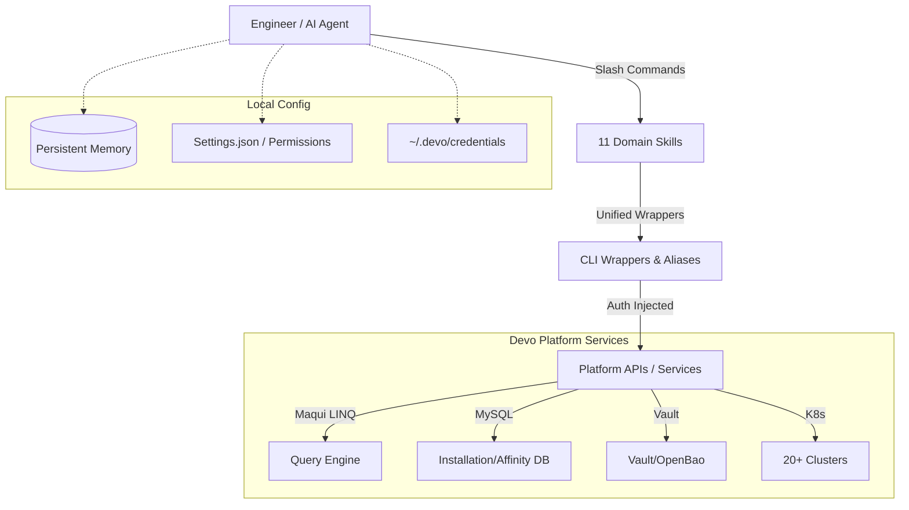

# AI Forge: Crescent Ecosystem for Devo Engineering

## Overview

AI Forge is a sophisticated AI-assisted operational ecosystem designed for Devo Platform Engineering. It transforms Claude (Sonnet 4.6/4.5) into a high-powered, domain-aware site reliability and platform engineer capable of managing a massive, multi-region infrastructure with unified commands.

## Problem Statement

Managing a global log analytics platform like Devo involves navigating:
*   **High Complexity:** 11+ distinct domain areas (Ingestion, Storage, Query, Security, etc.).
*   **Scale:** 7 global regions, 19+ Kubernetes clusters, and hundreds of EC2 datanodes.
*   **Auth Sprawl:** Scattered credentials and multi-account SSO logins.
*   **Risk:** High impact of destructive operations on production data.
*   **Context Loss:** "Re-explaining" platform architecture to AI assistants in every new session.

## Solution

AI Forge solves these challenges through:
1.  **Modular Skills:** 11 domain-specific "brain packs" loaded on demand.
2.  **Unified Wrapper Layer:** Abstraction over Maqui, MySQL, Vault, K8s, Jenkins, and Jira.
3.  **Vault-Grade Security:** Centralized, encrypted credential management with zero secret leakage.
4.  **Persistent Memory:** Cross-session context retention that matures over time.
5.  **Multi-Region Native:** First-class support for EU, US, US3, APAC, NCSC, and Santander regions.

## Architecture

AI Forge operates as a "Crescent" around the engineer's local environment, bridging local scripts with cloud-native platform services.

## Features

*   **Maqui Mastery:** Deep understanding of Maqui LINQ syntax and safe query patterns.
*   **Infrastructure Automation:** Ansible-driven deployments for resilience and maintenance.
*   **Security Ops:** Full lifecycle management of Vault secrets and TAPU tokens.
*   **Alert Lifecycle:** End-to-end management of Flow, Pilot, and Cockpit alerts.
*   **Automated Offboarding:** Standardized customer decommission workflows.
*   **Blast-Proof Safety:** Enforced deny-lists for destructive commands.

## Repository Structure

*   `.claude/CLAUDE.md`: The "Global Brain" rules and constraints.
*   `claude-skills/`: 11 domain-specific subdirectories containing expert knowledge.
*   `CLAUDE-AI-KT.md`: Comprehensive knowledge transfer and architecture reference.
*   `Marketing/`: Project collateral and flyers.
*   `terragrunt/`: IaC definitions for Lambda and API Gateway hubs.

## Workflow

1.  **Initialize:** `source ~/.zshrc` to load wrappers.
2.  **Invoke Skill:** Use `/devo-infra`, `/devo-query`, etc., to load domain context.
3.  **Execute:** Run unified aliases (e.g., `maquieu`, `sql usa_pro`, `kube`).
4.  **Validate:** Real-time feedback and reporting in the session.
5.  **Persist:** Insights are saved to `MEMORY.md` for the next session.

## AWS Services & Regions

AI Forge manages resources across:
*   **Regions:** `eu-west-1`, `us-east-1`, `us-east-2`, `ap-southeast-1`, `me-south-1`.
*   **Services:** EC2, EBS, EKS, RDS, S3, SNS, Lambda, API Gateway, Bedrock.

## Installation

### Prerequisites
*   Claude Code or compatible AI agent.
*   Access to `devo_corp` GitLab and Jenkins.
*   Regional AWS SSO profiles configured.

### Configuration
1.  Clone this repository to `~/Documents/Projects/AI-Forge`.
2.  Deploy credentials to `~/.devo/credentials` (chmod 600).
3.  Ensure `.claude/settings.json` matches the required model profiles.

## Security Considerations

*   **HMAC Verification:** All Slack/SNS triggers are cryptographically signed.
*   **Read-Only Jira:** Strict read-only access enforced for Jira/Confluence.
*   **Token Isolation:** Platform tokens never leave the wrapper execution environment.

## Author

**Vikash Jaiswal**  
Lead Platform Engineer | AI Systems Architect  
*Automating the future of Devo Engineering.*
