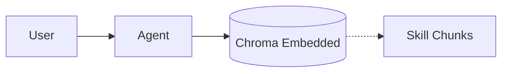
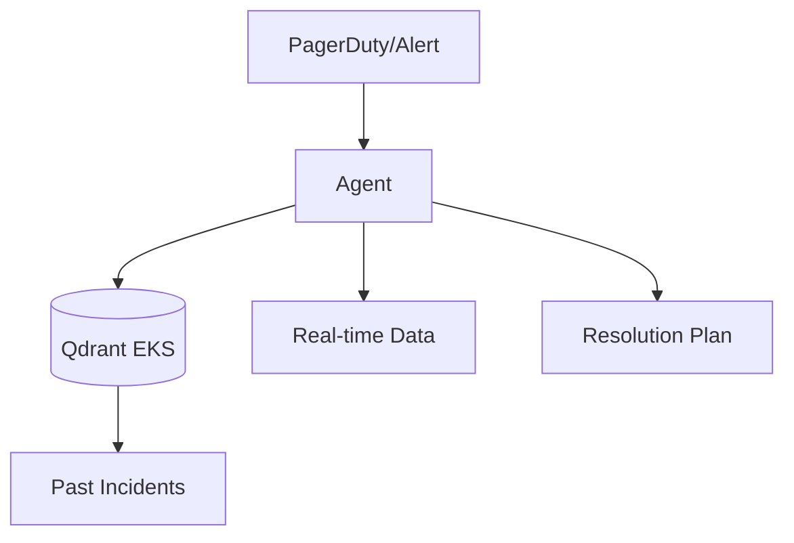
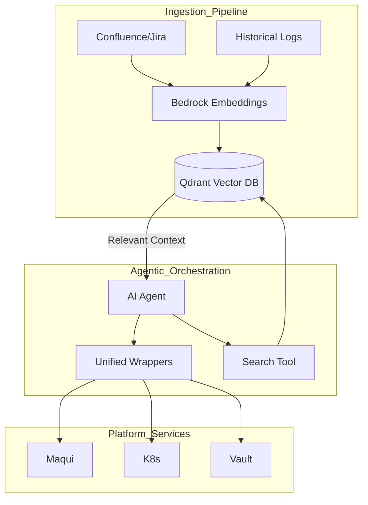

# Vector Database Roadmap: AI FORGE

## Vision
To evolve AI FORGE from a file-based deterministic retrieval system to a **Semantic Enterprise Knowledge Fabric**. By integrating a Vector Database, we will enable the AI agent to search millions of rows of documentation, historical incident logs, and architectural diagrams with sub-second latency and semantic understanding.

## Comparative Analysis of Vector Databases

| Feature | Chroma | Qdrant | Weaviate | Pinecone | pgvector |
|---------|--------|--------|----------|----------|----------|
| **Deployment** | Embedded / Server | Server (Rust) | Server (Go) | Managed (SaaS) | DB Extension |
| **Search** | Semantic | Hybrid | Hybrid | Semantic | Hybrid |
| **Ease of Use** | High (Python) | High | Medium | Very High | Medium |
| **Scaling** | Medium | High | High | Very High | High |
| **Best For** | Local/Proto | High-Performance | Enterprise | No-Ops | Existing Postgres |

### Recommendation: Qdrant
**Why:** Qdrant offers the best balance for AI FORGE:
1.  **High Performance:** Built in Rust, ideal for the low-latency requirements of Platform Engineering.
2.  **Hybrid Search:** Essential for Platform Ops (searching for specific error codes + semantic meaning).
3.  **Self-Hostable:** Can be deployed as a container within the existing EKS infrastructure.

---

## Evolution Roadmap

### Phase 1: Local Semantic Search (Current State to Embedded)
*   **Goal:** Replace keyword-based skill loading with semantic search.
*   **Tech:** ChromaDB (Embedded).
*   **Implementation:**
    *   Index all `SKILL.md` and `MEMORY.md` files.
    *   Implement a `search` tool that the agent calls when it's unsure which skill to use.
*   **Architecture:**

### Phase 2: Hybrid Platform Knowledge Base
*   **Goal:** Index external documentation (Confluence/Jira).
*   **Tech:** Qdrant (Deployed on EKS).
*   **Implementation:**
    *   Ingest the "Devo Internal Wiki" (Confluence) into Qdrant.
    *   Implement **Hybrid Search**: Combine BM25 (keyword) with Dense Vector (semantic) search.
*   **Benefit:** Agent can answer "How do we handle a metamalote OOM?" by retrieving the exact runbook.

### Phase 3: Autonomous Incident Retrieval
*   **Goal:** Connect historical incident logs to real-time triage.
*   **Tech:** Qdrant + Maqui Integration.
*   **Implementation:**
    *   Index historical "Critical" Slack threads and Jira incidents.
    *   When an alert fires, the agent automatically searches for similar past incidents.
*   **Architecture:**

### Phase 4: Enterprise Knowledge Fabric
*   **Goal:** Multi-modal and cross-platform intelligence.
*   **Tech:** Qdrant + Bedrock Multimodal.
*   **Implementation:**
    *   Index architectural diagrams (Mermaid, Draw.io).
    *   Enable the agent to "see" the network topology to identify single points of failure.
*   **Benefit:** Full situational awareness across the entire enterprise stack.

---

## Architecture Diagram (Target State)

## Next Steps
1.  **POC:** Initialize ChromaDB locally and index the `claude-skills` directory.
2.  **Benchmark:** Compare the accuracy of semantic retrieval vs. current slash-command triggers.
3.  **Infrastructure:** Request a Qdrant StatefulSet in the `eu-west-1` EKS management cluster.
